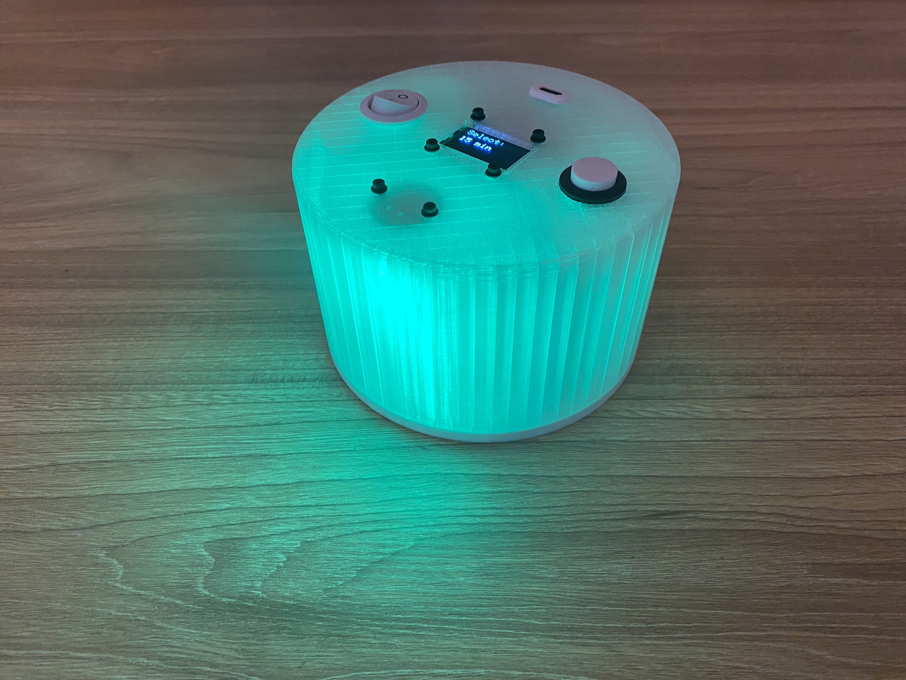

# Pomodoro Timer

A desk productivity timer built from scratch — custom hardware, embedded firmware, and a single-button interface that controls everything.

  
  &nbsp;&nbsp;
  

---

## Hardware

| Component | Part |
|-----------|------|
| Microcontroller | Arduino Uno |
| Display | SSD1306 128×64 OLED (I2C) |
| LEDs | 7× NeoPixel |
| Input | Tactile push button |

---

## How It Works

Set a session length (15 – 90 min) and hold the button to start. The LED ring drains one pixel at a time as the session progresses, shifting **green → orange → red** as time runs low. When the session ends the LEDs flash and a 5-minute break timer starts automatically.

**Everything is controlled with one button:**

| Gesture | Action |
|---------|--------|
| Tap | Cycle preset / Pause / Resume |
| Double tap | Cycle preset backward |
| Hold 3s | Start / Cancel |

---

## Firmware Highlights

- Finite state machine — `MENU → RUNNING → DONE → BREAK`
- Hardware debounce + double-tap detection, non-blocking
- OLED redraws only on second change — no flicker
- Last preset saved to EEPROM across power cycles

---

## Stack

`C++` · `Arduino` · `I2C` · `NeoPixel` · `EEPROM` · `CAD`

---

## Dependencies

- [Adafruit NeoPixel](https://github.com/adafruit/Adafruit_NeoPixel)
- [Adafruit SSD1306](https://github.com/adafruit/Adafruit_SSD1306)
- [Adafruit GFX](https://github.com/adafruit/Adafruit-GFX-Library)
